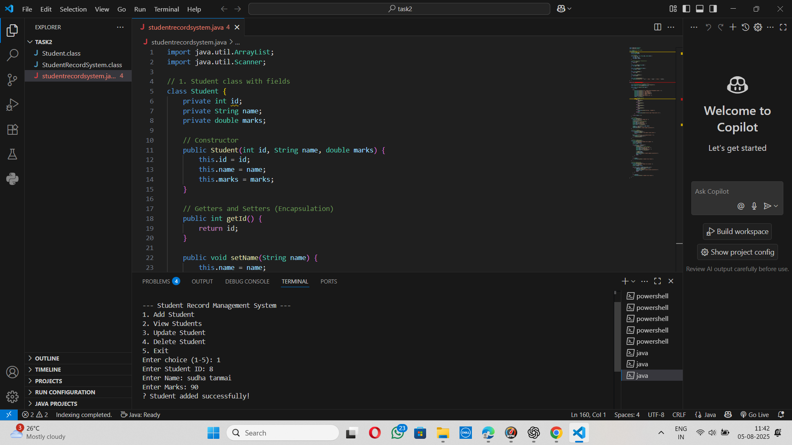

# 🎓 Student CRUD Java CLI

A simple **Java Command-Line Interface (CLI)** application to **Create**, **Read**, **Update**, and **Delete** (CRUD) student records using `ArrayList`.

---

## 👤 Author

**Sudha Tanmai**  
🔗 GitHub Repository: [StudentCRUD-JavaCLI](https://github.com/sudhatanmai/StudentCRUD-JavaCLI/tree/main)

---

## 🧰 Tools Used

- Java SE (JDK 17 or above)
- Visual Studio Code / IntelliJ CE
- Git & GitHub
- Command Prompt / Terminal

---

## ✅ Features

- ➕ Add a new student (ID, Name, Marks)  
- 📄 View all student records  
- ✏️ Update student details by ID  
- ❌ Delete student record by ID  
- 🚪 Exit the program

---

## 🔑 Concepts Practiced

- Java Classes & Objects  
- Encapsulation (private fields + getters/setters)  
- Collections (`ArrayList`)  
- Loops and Conditions  
- Java CLI input/output

---
## 📸 Screenshot




## ▶️ How to Run the Program

1. Open terminal and go to the project folder:

```bash
cd path/to/StudentCRUD-JavaCLI

